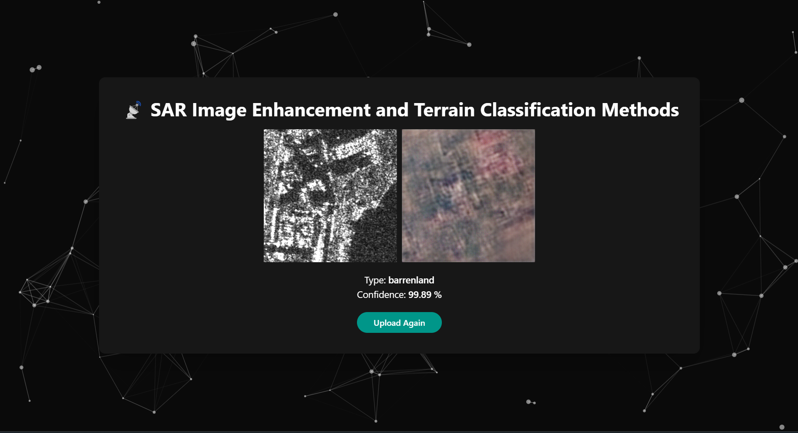

# 📡 SAR Image Enhancement and Terrain Classification Methods



Synthetic Aperture Radar (SAR) image enhancement and terrain classification are essential for accurate remote sensing analysis. Enhancement techniques, such as speckle noise reduction, histogram equalization, and deep learning-based super-resolution, improve image clarity and feature visibility. For terrain classification, Convolutional Neural Networks (CNNs) are commonly used to segment and categorize land cover types. Combining these techniques enables precise mapping for applications in agriculture, disaster response, and environmental monitoring.

Generative Adversarial Networks (GANs) play a crucial role in SAR image colorization, transforming grayscale SAR images into visually interpretable colorized representations. Since SAR images inherently lack natural color information, GANs learn complex mappings between SAR data and corresponding optical imagery, effectively generating realistic colorized outputs. The generator synthesizes colorized images, while the discriminator ensures realism by distinguishing between real and generated images. This approach enhances the interpretability of SAR data, aiding applications in terrain analysis, environmental monitoring, and disaster management by bridging the gap between SAR and optical imagery.

## ⚙️ Tech Stack

### 1. 🌐 Client

-   ⚛️ React
-   🔷 Typescript
-   📨 Axios
-   🎨 Tailwind CSS
-   🎊 TS Particles

### 2. ⚗️ Server

-   🐍 Python
-   ⚗️ Flask

### 3. 📦 Model

-   🐍 Python
-   🔢 Numpy
-   📊 Matplotlib
-   👁️ OpenCV
-   ⭕ Keras
-   📙 Tensorflow

## 🚶🏻‍♂️ Getting started

```bash
git clone https://github.com/naman22a/sar

cd sar
```

### 1. Train the Model

The dataset can be obtained from Kaggle

-   [aaryamenon/sar-image-colorization](https://www.kaggle.com/datasets/aaryamenon/sar-image-colorization/code)
-   [requiemonk/sentinel12-image-pairs-segregated-by-terrain](https://www.kaggle.com/datasets/requiemonk/sentinel12-image-pairs-segregated-by-terrain)

make a data folder inside model folder like this

```
data
├───archive
│   └───v_2
│       ├───agri
│       ├───barrenland
│       ├───grassland
│       └───urban
├───test
│   └───opt
│   └───sar
└───train
    └───opt
    └───sar
```

Create and activate the virtualenv inside model folder

```bash
pip install virtualenv
virtualenv env
source ./env/Scripts/activate
pip install -r requirements.txt
```

We have 2 models in model folder, train them from there respective files

-   src/GAN-colorization.ipynb
-   src/classification.ipynb

Copy `models/GAN-colorization.keras` and `models/classification.keras` from `model` folder to `server/models` folder

### 2. Setup the Server

```bash
# Create and activate the virtualenv inside server folder
pip install virtualenv
virtualenv venv
source ./venv/Scripts/activate
pip install -r requirements.txt

# Copy enviroment variables
cp .env.example .env

# Run the server
python app.py
```

### 3. Setup the Client

```bash
cp .env.example .env
yarn install
yarn dev
```
